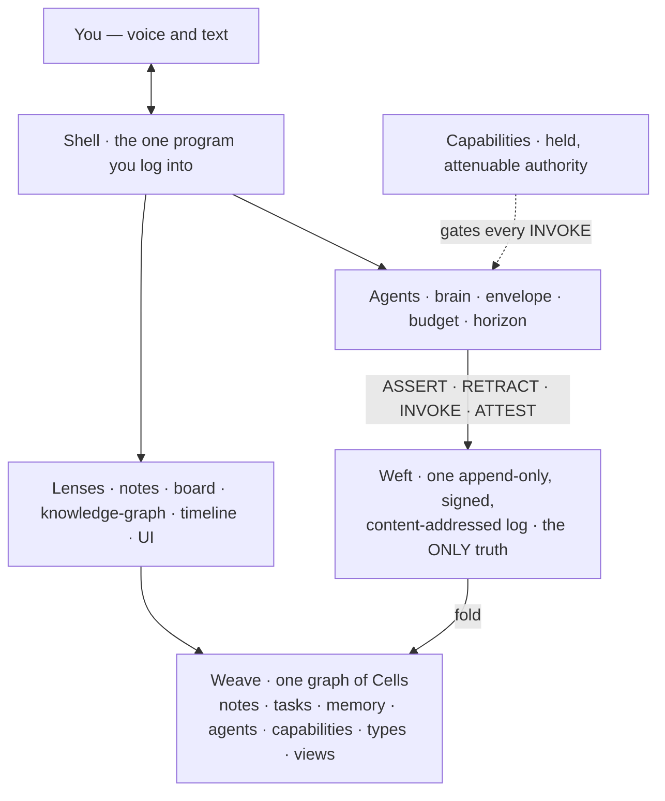
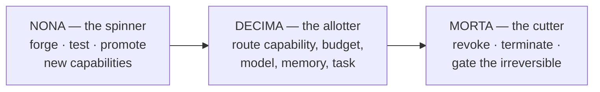
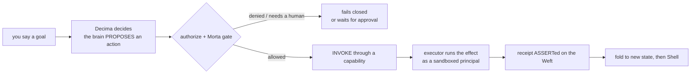
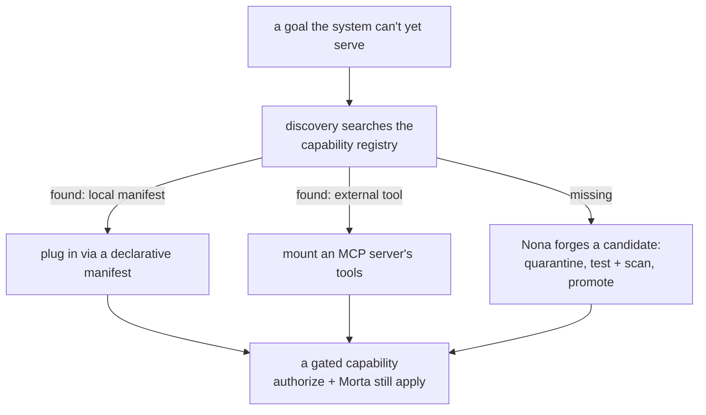

# Decima

**An agent-native operating system — one program you log into that connects you to your agents, your knowledge, and your work, and becomes more capable the longer it runs.** You talk to it; it organizes the agents, tools, context, models, and memory to get things done — and it holds the authority so that a rogue or prompt-injected agent still can't hurt you.

*Decima does not have features. It **grows** them.*

> **The poetic framing (it's load-bearing):** the whole OS is **four verbs over one append-only log**. State is a *fold*. Authority is a *held object*. The system is made of the same stuff as your data, so it can rewrite itself with the same tools it uses to edit your notes. Kernel: **LOOM** — spun by **Nona**, allotted by **Decima**, cut by **Morta**.

<!-- ^ Keep the first paragraph in sync with the GitHub repository "About" description. -->

**New here?** Read this file top-to-bottom (~2 min). Then go deep:
[`VISION.md`](VISION.md) is the canonical source of truth (the *what & why*) · [`KERNEL.md`](KERNEL.md) is the *how* (laws, primitives, worked traces) · [`heartbeat/`](heartbeat/) is the running proof.

---

## Architecture at a glance

One append-only log is the only truth. Everything else — your notes, your memory, the UI, the agents themselves — is *derived from it by folding*, and *written back to it* through four verbs, gated by capabilities.



*Read path (down): Weft → fold → Weave → project → Lenses → Shell. Write path (up): Shell → Agents → four verbs → Weft. Capabilities gate every effect.*

---

## The Five Laws

Not guidelines — enforced by the *shape* of the system. Break one and it isn't Decima anymore.

1. **Nothing happens off the Log.** Every change is a signed, content-addressed event appended to one log, the **Weft**. If it isn't in the Weft, it didn't happen.
2. **No ambient authority.** A principal can do *exactly* what the capabilities it holds permit — no admin, no root, no sudo. Power is a possessable object, not a status. (The object-capability model, taken religiously.)
3. **Everything is a Cell — including Decima itself.** Note, task, memory, agent, capability, policy, view, *type* — all Cells in one graph (the **Weave**). The system is homoiconic, which is what makes it self-extending.
4. **Identity is content plus cause.** Objects are content-addressed (id = hash of bytes); their meaning is the causal chain that produced them.
5. **State is a fold; everything you see is a projection.** The Weave, the search index, your memory, the UI — all derived from the Weft, all rebuildable, none canonical. The log is the only truth.

## The four verbs — the entire instruction set

The whole OS — voice, code, image generation, posting, memory, security, the UI — is expressed in four verbs. There is no special `grant`/`revoke`: capabilities are Cells, so granting is `ASSERT`-ing an edge and revoking is `RETRACT`-ing one. **The security model and the note-taking model are the same model.**

| verb | meaning | axis |
|---|---|---|
| **ASSERT** | bring a fact / Cell version into being | belief |
| **RETRACT** | withdraw a prior assertion (a tombstone — nothing is ever truly deleted) | belief |
| **INVOKE** | request an effect in the world, through a capability | action |
| **ATTEST** | witness / sign another event (verification, trust, promotion) | trust |

## The trinity — Nona · Decima · Morta

Named for the Roman Fates (Parcae). The mythology is load-bearing: every name tells you what the code does.

| Fate | Role | What it does |
|---|---|---|
| **Nona** (Clotho, the spinner) | self-extension engine | forges, tests, and promotes new capabilities — the organ that makes organs |
| **Decima** (Lachesis, the allotter) | orchestrator / router | apportions capability, budget, model, memory, and tasks to the work (also the project's name) |
| **Morta** (Atropos, the cutter) | revocation & the gates | termination, revocation, and the *unstrippable* human-approval gates on irreversible effects |



---

## Two flows that show how it works

**The action path** — every effect travels the same gated road, and lands as an auditable receipt on the log:



A prompt-injected model has no more power than the offline rule stub: it can only *propose*, and `authorize` gates every effect. Attenuation means authority only flows *downhill*, so there is no escalation path to inject toward.

**The plug-in flow** — Decima grows capability instead of shipping a fixed feature set. Given a goal it can't yet serve, it looks for a fit; if none exists, Nona forges one — and either way the result is a *gated* capability:



---

## What's real today vs. the vision

This repo is a **reference / prototype**, not a finished product. It is honest about the gap.

### Real, running now — the Heartbeat

A pure-Python-**stdlib** reference (`heartbeat/`) — **no dependencies, no network** — that is both an *executable spec* and a *conformance oracle*. It proves the Five Laws by running. What breathes today:

- **The kernel** — a signed, append-only Weft; the four verbs; a fold with time-travel; object-capability authority with signed possession, attenuation, leases, and anti-replay; retraction + cascade; effect receipts; and networked sync / ingest.
- **A cognitive layer** — typed memory (and memory-as-governance), orientation, planning → execution, dispatch, and an autonomy ladder wired into the live loop.
- **A blue/red security flagship** — detection-as-code → triage/SIEM, red-team, and a purple-team loop.
- **~25 real external engines** — payments (Stripe), OIDC, tax, KYC, brokerage, comms, shipping, and more — each wrapped over stdlib `urllib` (zero pip deps). **These are test-mode / sandbox / Morta-gated**: money movement, posting, deploys, and other irreversible effects require human approval, and most external actions are gated stubs by design.
- **A modularity / plug-in layer** — declarative capability manifests + a registry; an **MCP client** (mount any MCP server's tools as gated capabilities) and an **MCP server** (expose Decima's own); tool **discovery** (find a fit → plug in → forge if missing); Rules of Engagement; and deterministic context folding.

The Heartbeat is deliberately a **profile** — smaller than the durable protocol. [`heartbeat/PROFILE.md`](heartbeat/PROFILE.md) pins exactly what's built vs. deferred (e.g. dev-grade HMAC signing stands in for Ed25519; JSON stands in for CBOR).

### The vision (see [`VISION.md`](VISION.md))

A user-owned, agent-native OS you can point at almost any digital ambition: voice-first, multimodal, a studio, an inbox you never open directly, a workspace, social/business ops, full SDLC automation — all accreting as Cells on a living spine. The eventual **single Rust port is the last step**, gated on the reference being stable — it is *distant*, not near.

### Quickstart

```bash
cd heartbeat
python3 smoke.py          # scripted tour: the Five Laws + the FOLD §11 invariants
python3 run.py --fresh    # the interactive Shell (the "one program"), from genesis
```

Optional: export `ANTHROPIC_API_KEY` to let `claude-opus-4-8` decide each turn instead of the offline rule brain. Either way `authorize()` gates every effect, so the model never exceeds its envelope.

---

## Status

- **41 build cycles** complete (kernel hardening → make-a-stub-real → the modularity/plug-in layer).
- **148 conformance-check modules** (`heartbeat/checks/`) run green by `smoke.py`, plus the scripted five-laws tour and tamper-evidence check.
- **All 8 FOLD §11 invariants hold** (replay determinism, arrival-order independence, duplicate-delivery harmlessness, revoked-authority-fails-closed, downhill scope, no-effect-on-replay, redaction, and `UNKNOWN` resolution).

Full board and per-cycle detail: [`docs/BACKLOG.md`](docs/BACKLOG.md). Scope still ahead: [`specs/CAPABILITY_MAP.md`](specs/CAPABILITY_MAP.md).

## Layout

| path | what |
|---|---|
| [`VISION.md`](VISION.md) | the vision — what Decima is, what it's for, how far it reaches (**start here**) |
| [`KERNEL.md`](KERNEL.md) | the kernel design — the laws, primitives, and worked traces |
| [`specs/`](specs/) | formal protocol specs — Weft, fold lifecycle, Nona, Morta/capabilities, memory, browser, donor matrix |
| [`heartbeat/`](heartbeat/) | the **running** pure-stdlib prototype (see [`heartbeat/README.md`](heartbeat/README.md)) |
| [`heartbeat/PROFILE.md`](heartbeat/PROFILE.md) | the prototype's profile vs. the durable protocol — **what's built vs. deferred** |
| [`docs/BACKLOG.md`](docs/BACKLOG.md) | the build board — status, cycles, coordination rules |

---

*Decima, woven on the Loom — spun by Nona, allotted by Decima, cut by Morta.*
